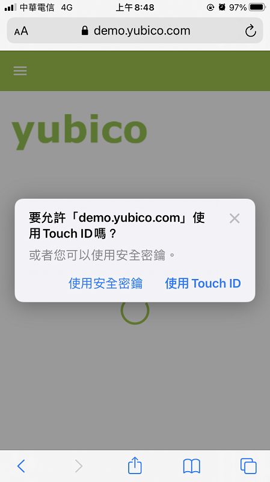
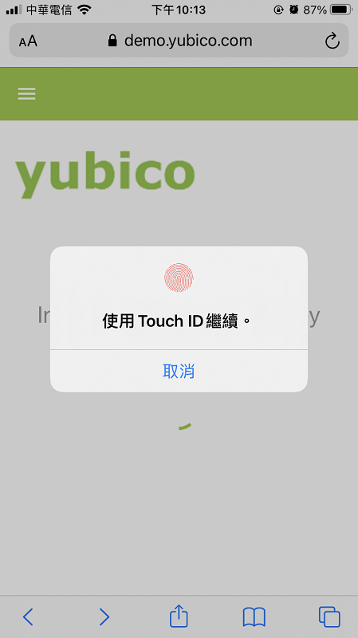
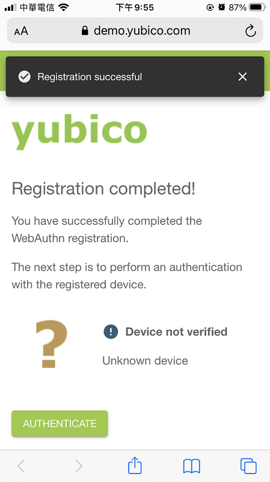
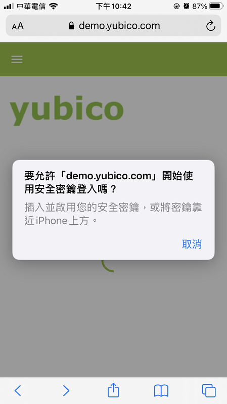
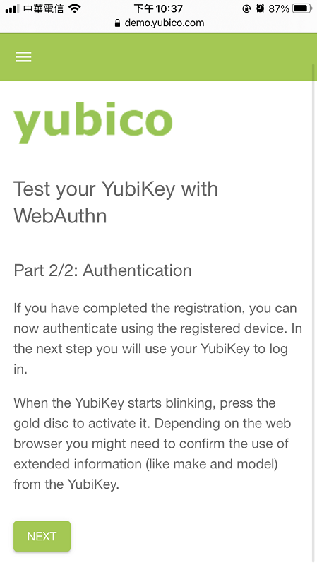
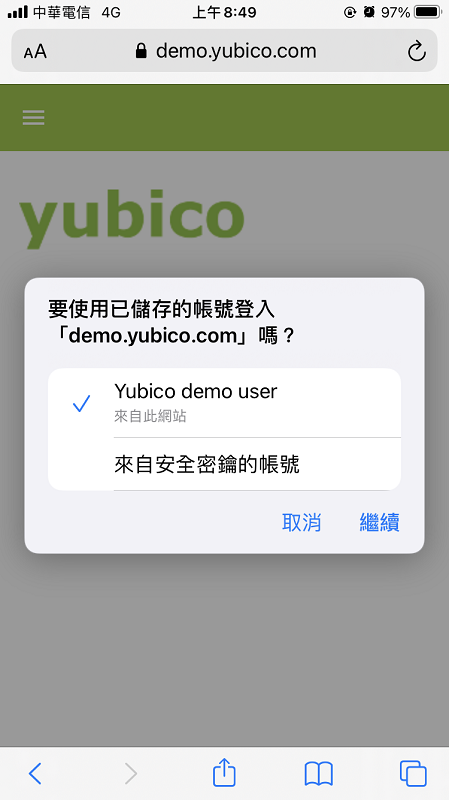
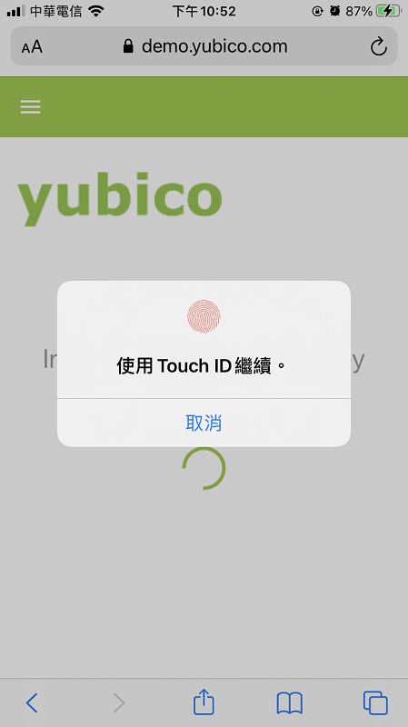
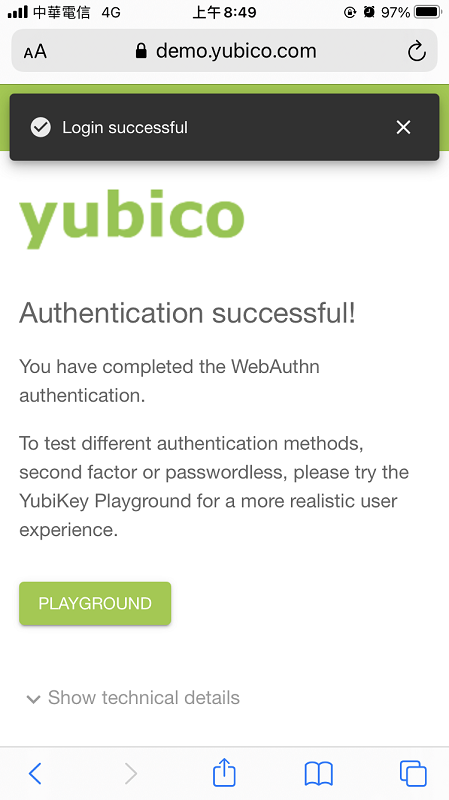
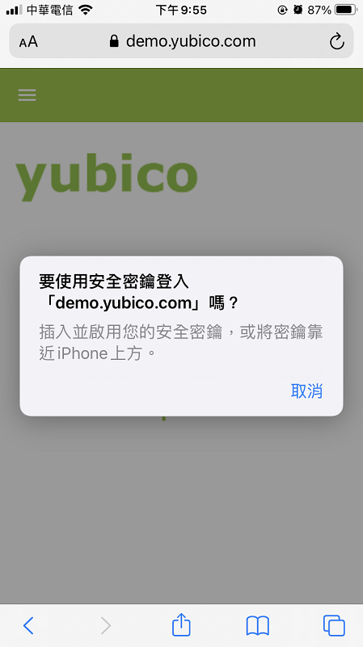

# FIDO

FIDO2

iOS 14.0.1

## 註冊

註冊手機

 

使用「 Touch ID」

 

註冊成功

 

註冊金鑰

 

## 驗證

 驗證

 

 

 

 

 

## 交易資訊

1

```json
{
    "publicKey": {
        "allowCredentials": [
            {
                "id": "MwS/mCxaP4uSMnAlqvBvWQ89fV8=",
                "type": "public-key"
            }
        ],
        "challenge": "4ckX9OfgH5A6q78Qo7gbionyMgAvuNcha8Bcguu1ysk=",
        "rpId": "demo.yubico.com",
        "timeout": 90000,
        "userVerification": "discouraged"
    }
}
```

2

```json
{
  "id": "MwS_mCxaP4uSMnAlqvBvWQ89fV8",
  "response": {
    "authenticatorData": "xGzvgq0bVGR3WR0Aiwh1nsPm0uy085R0v+ppaZJdA7cFAAAAAA==",
    "clientDataJSON": "eyJ0eXBlIjoid2ViYXV0aG4uZ2V0IiwiY2hhbGxlbmdlIjoiNGNrWDlPZmdINUE2cTc4UW83Z2Jpb255TWdBdnVOY2hhOEJjZ3V1MXlzayIsIm9yaWdpbiI6Imh0dHBzOi8vZGVtby55dWJpY28uY29tIn0=",
    "signature": "MEYCIQD7Q3LlnPkkndTg/qNAtKp93lU1og+IwsXGlsBBRjJk8QIhALXWgunZ5K/9osGwQB2s5buY6dMqpJJ4oJ/HJwU13ACT",
    "userHandle": "CGAFFleIBEifyCNdmNIrV7DZh8P9Qn4j8azG4eVGp8Y="
  },
  "clientExtensionResults": {}
}
```

```json
{
  "type": "webauthn.get",
  "challenge": "4ckX9OfgH5A6q78Qo7gbionyMgAvuNcha8Bcguu1ysk",
  "origin": "https://demo.yubico.com"
}
```

3

```json
{
  "success": true,
  "authenticatorData": {
    "authData": {
      "credentialData": {
        "aaguid": "AAAAAAAAAAAAAAAAAAAAAA==",
        "credentialId": "MwS/mCxaP4uSMnAlqvBvWQ89fV8=",
        "publicKey": {
          "1": 2,
          "3": -7,
          "-1": 1,
          "-2": "Gojq2IutmhljRW+b8nyMaY+6dfP1+fM/uKAyDhS08ME=",
          "-3": "1L2pN1DGhpNI5bP8cJLoNz2dMrWbJqtqoFVAcEjCWIY="
        }
      },
      "flags": {
        "AT": false,
        "ED": false,
        "UP": true,
        "UV": true,
        "value": 5
      },
      "rpIdHash": "xGzvgq0bVGR3WR0Aiwh1nsPm0uy085R0v+ppaZJdA7c=",
      "signatureCounter": 0
    },
    "clientData": {
      "challenge": "4ckX9OfgH5A6q78Qo7gbionyMgAvuNcha8Bcguu1ysk",
      "origin": "https://demo.yubico.com",
      "type": "webauthn.get"
    }
  },
  "username": "Yubico demo user"
}
```

